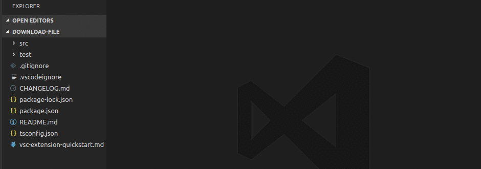

# vscode-download-file
[](https://marketplace.visualstudio.com/items?itemName=dariofuzinato.download-file)

## Features

This extension lets you download any file directly to your project. 


## Customize expension
There is a settings options to specify default folder where files will be saved. By default it is root of your project, but it can be changed to your needs. For example to save all files directly to "vendor" folder, go to preferences/settings and change following option:
```
"download-file.defaultFolder": "vendor"
```

If folder does not exist, it will be automatically crated.

## Contributing

Contributions and suggestions are greatly appreciated.

## Release Notes

### 0.0.1

  * Initial release

### Thanks

**Enjoy!**
